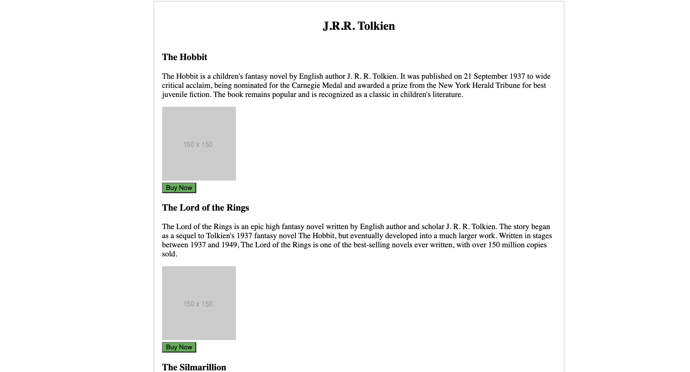
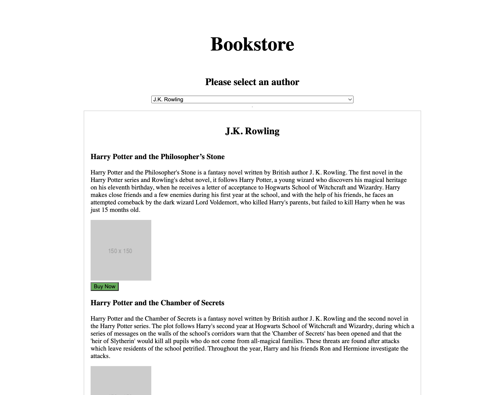
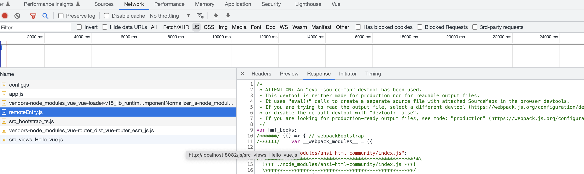

# What is Module Federation

Module Federation is a way of building remote code bundles that can be compiled at runtime to create a seamless experiences. This is a modern way of creating a Micro Frontend which does not have any compile time dependencies and integration can be done in a truly modular way.

### Federation

A federation is a group of applications or components with a centralized governing body but independent in internal affairs. This allows teams to build with their own technology stack including their build and deploy pipeline and tools. This ultimately promotes a high level of autonomy for the producers. To safeguard this, these teams will be required to adhere to the overall standards put in place at the higher levels of the federation.

### Modules

Modules are independently developed and deployed without tightly coupled dependencies. Containers or Modules will load these Modules at runtime and arrange them as a single application; Similar to Micro-Services, these Micro-Frontends are the building blocks of modern applications. These Modules can be as small as a button or as large as an entire page.

### Containers

Containers are the top-level shell applications which load the Modules producing the resulting page. These are responsible for implementing the top-level concerns of the federation such as navigation. Containers can be loaded within other Containers to create increasingly complex experiences; this pattern is known as "Nested Containers."

# Getting Started

This guide is designed to help you:

- Obtain a basic understanding of Module Federation principles
- Create and expose a Module
- Consume a module from a remote host

## Requirements

This guide assumes you are familiar with the command line and JavaScript and you have a recent version of Node.js (12.13+) installed.
If you have not already done so, you will need to make sure your NPM can authenticate with JFrog, please reference [this guide](http://digitaldocs.humana.com/docs/client-arch-wiki/nucleus/connecting-to-feed/).

## Create a Project

The Enrollment and Onboarding team [maintains a repository](https://dev.azure.com/humana/Digital%20Health%20and%20Analytics/_git/hmf-template) that holds the skeleton template for building HMF compliant Modules. We recommend using it as a starting point for building your project.

From your preferred development directory, create a directory for the new project, clone the template repository into it and `cd` into the directory:

```bash
mkdir hmf-books
git clone https://humana@dev.azure.com/humana/Digital%20Health%20and%20Analytics/_git/hmf-template hmf-books
cd hmf-books
# Add new remote url when ready
#git remote set-url origin new.url.here
```

## Install Dependencies

Install them with the ci command

```bash
npm ci
```

## Create and Expose a Module

In this section, we will create a simple books component to display an author and their books, expose it, and consume it.

### Create a Component

```bash
mkdir src/components
touch src/components/books.vue
```

books.vue

```html
<template>
  <div class="books-container">
    <h2 v-text="author"></h2>
    <div v-for="book in books" :key="book.id">
      <h3 v-text="book.title"></h3>
      <p v-text="book.description"></p>
      
      <button class="buy" type="button" @click="onClick(book)">Buy Now</button>
    </div>
  </div>
</template>

<script lang="ts">
  import { Component, Prop, Vue } from 'vue-property-decorator';

  @Component
  export default class books extends Vue {
    @Prop()
    public author: string;
    @Prop()
    public books: [];

    public onClick(book: any) {
      this.$emit('buy', book);
    }
  }
</script>

<style scoped lang="scss">
  .books-container {
    display: flex;
    flex-direction: column;
    align-items: center;
    justify-content: center;
    margin: 0 auto;
    max-width: 800px;
    border: 1px solid #ccc;
    padding: 1rem;
  }
  .buy {
    background-color: #4caf50;
    display: block;
  }
</style>
```

Add the books component to **/src/views/Hello.vue** file. Add some data to test it locally.

```html
<template>
  <div>
    <Books :author="'J.R.R. Tolkien'" :books="books" />
  </div>
</template>

<script lang="ts">
  import { Component, Vue } from 'vue-property-decorator';
  import Books from '../components/books.vue';
  @Component({
    name: 'HelloView',
    components: {
      Books,
    },
  })
  export default class HelloViewComponent extends Vue {
    books = [
      {
        id: '1',
        title: 'The Hobbit',
        description:
          "The Hobbit is a children's fantasy novel by English author J. R. R. Tolkien. It was published on 21 September 1937 to wide critical acclaim, being nominated for the Carnegie Medal and awarded a prize from the New York Herald Tribune for best juvenile fiction. The book remains popular and is recognized as a classic in children's literature.",
        image: 'https://via.placeholder.com/150',
      },

      {
        id: '2',
        title: 'The Lord of the Rings',
        description:
          "The Lord of the Rings is an epic high fantasy novel written by English author and scholar J. R. R. Tolkien. The story began as a sequel to Tolkien's 1937 fantasy novel The Hobbit, but eventually developed into a much larger work. Written in stages between 1937 and 1949, The Lord of the Rings is one of the best-selling novels ever written, with over 150 million copies sold.",
        image: 'https://via.placeholder.com/150',
      },
      {
        id: '3',
        title: 'The Silmarillion',
        description:
          "The Silmarillion is a collection of tales set in the world of Arda, written by J. R. R. Tolkien. It is the first published book-length history of Middle-earth, and is considered by many to be the first draft of The Lord of the Rings. The Silmarillion was published in 1977, after Tolkien's death, by his son Christopher, who edited the work for publication.",
        image: 'https://via.placeholder.com/150',
      },
    ];
  }
</script>

<style></style>
```

Serve up the application locally to see changes made.

```bash
npm run serve
```



### Document the Module

It's recommended to add a markdown file for each exposed component(s) in it's directory. This will be used to document the component and provide a link to the component in the HMF registry.

```bash
touch src/components/books.md
```

```markdown
# HMF

## **Component Name:** Books

**Description:** A component that displays a list of books.

### Requirements

- Some Requirements here....

### Props

| Name   | Type   | Description                   |
| ------ | ------ | ----------------------------- |
| books  | Array  | An array of books to display. |
| author | String | The author of the books.      |

### Events

| Name | Type | Description |
| ---- | ---- | ----------- |
| buy  | Any  | on click    |
```

### Expose the Component

In order to expose the component, we need to add a remote entry to the vue.config (webpack config). Under module federation plugin add the below code.

```javascript
// infer the public path at runtime.
// entry name must match exposed container name, here it is 'hmf-books'
config.entry('hmf_books').add('./module-federation/set-public-path');

config.plugin('module-federation-plugin').use(ModuleFederationPlugin, [
  {
    name: 'hmf_books', // name of the exposed container
    filename: 'remoteEntry.js',
    // exposing books component
    exposes: {
      './books': './src/components/books.vue',
    },
    remotes: {},
    shared: {
      ...PackageDependencies,
      vue: {
        eager: true,
      },
      'vue-property-decorator': {
        eager: true,
      },
      'vue-class-component': {
        eager: true,
      },
    },
  },
]);
```

Configuration options are listed below:

- **Name** – the unique name for the exposed container, when it is initialized, the name you entered will be used as the file name for the container’s relative path.
- **Filename** - used to specify the file name for the output bundle that also serves as an entry point to the bundle.
- **Exposes** - This is the path to the module or files exposed by the container; it can be an object or an array.
- **Remote** - is a list of static remote modules that can be accessed by the local module. Remote can be an array or an object.
- **Shared** - option allows you to share your node libraries for which the exposed module depend on to run.

  **\*Note:** <em>There is little to no dependency duplication. Through the shared option, remotes will depend on host dependencies, if the host does not have a dependency, the remote will download its own. No code duplication but built-in redundancy.</em>

## Create Host Application

From your preferred development directory, create a directory for the new project, clone the template repository into it and `cd` into the directory:

```bash
mkdir hmf-bookstore
git clone https://humana@dev.azure.com/humana/Digital%20Health%20and%20Analytics/_git/hmf-template hmf-bookstore
cd hmf-bookstore
```

## Install Dependencies

Install them with the ci command

```bash
npm ci
```

## Add mock author and book data

```bash
mkdir src/data
touch src/data/authorBooks.js
```

Add to file authorBooks.js

```javascript
const data = [
  {
    id: 1,
    name: 'J.K. Rowling',
    books: [
      {
        id: '1',
        title: 'Harry Potter and the Philosopher’s Stone',
        description:
          "Harry Potter and the Philosopher's Stone is a fantasy novel written by British author J. K. Rowling. The first novel in the Harry Potter series and Rowling's debut novel, it follows Harry Potter, a young wizard who discovers his magical heritage on his eleventh birthday, when he receives a letter of acceptance to Hogwarts School of Witchcraft and Wizardry. Harry makes close friends and a few enemies during his first year at the school, and with the help of his friends, he faces an attempted comeback by the dark wizard Lord Voldemort, who killed Harry's parents, but failed to kill Harry when he was just 15 months old.",
        image: 'https://via.placeholder.com/150',
      },
      {
        id: '2',
        title: 'Harry Potter and the Chamber of Secrets',
        description:
          "Harry Potter and the Chamber of Secrets is a fantasy novel written by British author J. K. Rowling and the second novel in the Harry Potter series. The plot follows Harry's second year at Hogwarts School of Witchcraft and Wizardry, during which a series of messages on the walls of the school's corridors warn that the 'Chamber of Secrets' has been opened and that the 'heir of Slytherin' would kill all pupils who do not come from all-magical families. These threats are found after attacks which leave residents of the school petrified. Throughout the year, Harry and his friends Ron and Hermione investigate the attacks.",
        image: 'https://via.placeholder.com/150',
      },
      {
        id: '3',
        title: 'Harry Potter and the Prisoner of Azkaban',
        description:
          "Harry Potter and the Prisoner of Azkaban is a fantasy novel written by British author J. K. Rowling and the third novel in the Harry Potter series. The book follows Harry Potter, a young wizard, in his third year at Hogwarts School of Witchcraft and Wizardry. Along with friends Ronald Weasley and Hermione Granger, Harry investigates Sirius Black, an escaped prisoner from Azkaban who they believe is one of Lord Voldemort's old allies.",
        image: 'https://via.placeholder.com/150',
      },
      {
        id: '4',
        title: 'Harry Potter and the Goblet of Fire',
        description:
          "Harry Potter and the Goblet of Fire is a fantasy novel written by British author J. K. Rowling and the fourth novel in the Harry Potter series. It follows Harry Potter, a wizard in his fourth year at Hogwarts School of Witchcraft and Wizardry, and the mystery surrounding the entry of Harry's name into the Triwizard Tournament, in which he is forced to compete.",
        image: 'https://via.placeholder.com/150',
      },
    ],
  },
  {
    id: 2,
    name: 'J.R.R. Tolkien',
    books: [
      {
        id: '1',
        title: 'The Hobbit',
        description:
          "The Hobbit is a children's fantasy novel by English author J. R. R. Tolkien. It was published on 21 September 1937 to wide critical acclaim, being nominated for the Carnegie Medal and awarded a prize from the New York Herald Tribune for best juvenile fiction. The book remains popular and is recognized as a classic in children's literature.",
        image: 'https://via.placeholder.com/150',
      },

      {
        id: '2',
        title: 'The Lord of the Rings',
        description:
          "The Lord of the Rings is an epic high fantasy novel written by English author and scholar J. R. R. Tolkien. The story began as a sequel to Tolkien's 1937 fantasy novel The Hobbit, but eventually developed into a much larger work. Written in stages between 1937 and 1949, The Lord of the Rings is one of the best-selling novels ever written, with over 150 million copies sold.",
        image: 'https://via.placeholder.com/150',
      },
      {
        id: '3',
        title: 'The Silmarillion',
        description:
          "The Silmarillion is a collection of tales set in the world of Arda, written by J. R. R. Tolkien. It is the first published book-length history of Middle-earth, and is considered by many to be the first draft of The Lord of the Rings. The Silmarillion was published in 1977, after Tolkien's death, by his son Christopher, who edited the work for publication.",
        image: 'https://via.placeholder.com/150',
      },
    ],
  },
];

export default data;
```

## Configure the Host Application

The template project comes with a public global config.js file. We can set the url to remote module here.

```javascript
// config.js file
const config = (() => {
  return {
    VUE_APP_GRAPH_URL:
      'https://experience-api-app-exp-sit.npii-aks.dhp-east2us-npe.humana.com/graphql',
    // Remote url
    BOOKS_URL: 'http://localhost:8081',
  };
})();
```

### Configure vue.config (webpack config) to consume remote module

```javascript
    config.plugin('module-federation-plugin').use(ModuleFederationPlugin, [
      {
        name: 'hmf_bookstore',
        remotes: {
          hmf_books: dynamicRemote({
            remoteName: 'hmf_books',
            configProperty: 'BOOKS_URL',
          }),
        },
        shared: {
          ...PackageDependencies,
          vue: {
            eager: true,
          },
          'vue-property-decorator': {
            eager: true,
          },
          'vue-class-component': {
            eager: true,
          },
        },
      },
    ]);
  },
```

We'll need to update shims-vue.d.ts file to include the remote module so we don't get compile time errors since the module is not known until runtime.

```typescript
// shims-vue.d.ts
declare module 'hmf_books/*';
```

### Replace Hello.vue

```html
<template>
  <div>
    <div class="book-store">
      <h1>Bookstore</h1>
      <h2>Please select an author</h2>
      <select v-model="selectedAuthor" @change="onSelected">
        <option disabled value="">Select</option>
        <option v-for="item in authors" :key="item.id" :value="item.id">
          {{ item.name }}
        </option>
      </select>
      <hr />
    </div>

    <author-books
      v-if="author"
      :author="author.name"
      :books="author.books"
      @buy="onBuy"></author-books>
  </div>
</template>

<script lang="ts">
  import { Component, Vue } from 'vue-property-decorator';
  import authorBooks from '../data/authorBooks';

  @Component({
    name: 'HelloView',
    components: {
      //Load remote module
      'author-books': () => import('hmf_books/books'), // container name/module name
    },
  })
  export default class HelloViewComponent extends Vue {
    public selectedAuthor = 0;
    public authors = authorBooks;
    public author: {} | null = null;

    public onSelected() {
      this.author = this.authors.find(
        (item) => item.id === this.selectedAuthor
      );
    }

    public onBuy(book: any) {
      alert(`You bought ${book.title} by module federation`);
    }
  }
</script>

<style lang="scss" scoped>
  .book-store {
    margin-top: 60px;
    display: flex;
    flex-direction: column;
    align-items: center;
    > h1 {
      font-size: 3rem;
    }
    > select {
      width: 100%;
      max-width: 500px;
    }
  }
</style>
```

### Serve Applications

Make sure the books application is running. Then serve up the bookstore application.

```bash
npm run serve
```

You should see the remote module loaded in the host application.



If you open your browser's dev tools you should also see the remote script requested in the host application.



## What happens if the remote is down?

If the remote module is down, the host application will probably not load. To mitigate this, we can return an empty resolve in the **dynamic-remote.js** file. Add the below code inside the promise script.

```javascript
script.onerror = (e) => {
  console.error('${options.remoteName} is not available');
  resolve();
};
```

Another option is to create an error boundry component.

```html
<!-- Coming soon -->
```

## Further Reading

- [Module Federation](https://webpack.js.org/concepts/module-federation/)
- [Module Federation Examples](https://github.com/module-federation/module-federation-examples)
- [Module Federation Video](https://www.youtube.com/watch?v=lKKsjpH09dU)
